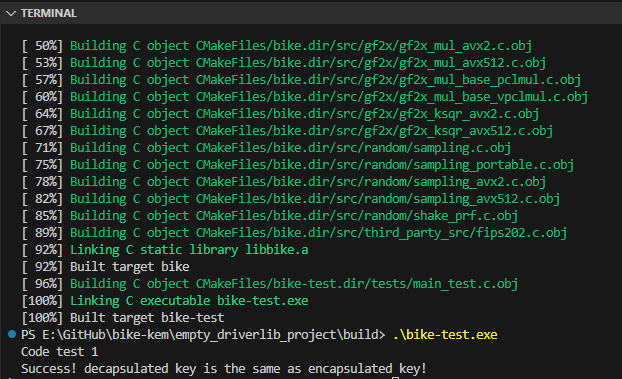

# Compiling the project

## Steps:
1. create a build folder
   1. > mkdir build 
   2. > cd build
2. run cmake with MinGW
   1. > cmake .. -G "MinGW Makefiles"
3. build the project to generate the excutable
   1. > mingw32-make
4. run the excutable
   1. >./bike-test.exe

## 💡 What is MinGW?

* MinGW stands for "Minimalist GNU for Windows". It's a native Windows port of the GNU Compiler Collection (GCC), which includes:

    - A C and C++ compiler (gcc, g++)

    - Tools like make, gdb (debugger), ld (linker), etc.

    - Basic POSIX libraries (just enough to compile Unix-style code on Windows)

## 🛠️ Why Do You Need MinGW?

* Most open-source C/C++ projects (like BIKE) use CMake + GCC to build. If you're on Linux or macOS, you already have GCC or Clang.

* But on Windows, you need something like MinGW to:

    - Compile C/C++ code using GCC

    - Use CMake with -G "MinGW Makefiles"

    - Build cross-platform projects like cryptographic libraries or embedded firmware tools